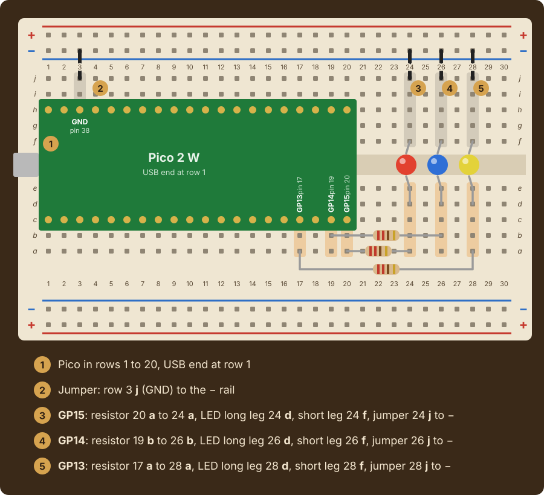
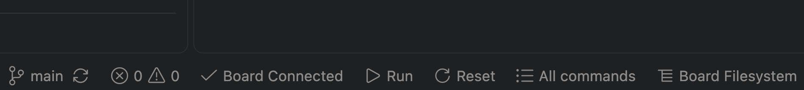

# Lab 4: LED Light Show

|Item |       |
|:----|:------|
|Released |Friday, October 2, at the lab session |
|Due |Friday, October 16, 2:30pm |
|Progress |[](../../actions/workflows/main.yml) |

Three LEDs on a breadboard, and one list to hold them. A list lets you write each stage of the
show once, against all the lights at the same time, so that the same program runs unchanged
when the list grows to six.

## Contents

* [Course learning outcomes](#course-learning-outcomes)
* [The circuit](#the-circuit)
* [The four stages](#the-four-stages)
  * [The show log](#the-show-log)
  * [Expected output](#expected-output)
* [Getting started](#getting-started)
  * [Testing on your Pico](#testing-on-your-pico)
* [Evaluation](#evaluation)
  * [Programming, 3.0 points](#programming-30-points)
  * [Code quality and style, 1.0 point](#code-quality-and-style-10-point)
  * [Summary writing, 0.5 points](#summary-writing-05-points)
* [Code review](#code-review)
* [Submitting](#submitting)

## Course learning outcomes

This lab addresses the following course learning outcomes:

**CLO 1.** Apply Python programming fundamentals to execute and explain computer code that
implements interactive, novel solutions to a variety of computable problems.

**CLO 2.** Implement code consistent with industry-standard practices using professional-grade
integrated development environments (IDEs), command-line tools, and version control systems.

Specifically, by the end of this lab you should be able to:

* keep several related values in one list and read how many there are with `len`
* pick one item out of a list by position, and convert between the number a person uses and
  the position the list uses
* visit every item of a list with `for item in a_list`
* build a list one item at a time with `append`
* wire an LED to a GPIO pin through a resistor on a breadboard

## The circuit

You need your Pico 2 W, a breadboard, three LEDs, three resistors (220 or 330 ohms, either
works), and jumper wires. Unplug the USB cable before you touch the wiring.

**Before you start the lab, wire one light on GP15 and get it to light up**, following the
[Week 6 Session 2 slides](https://computationalexpression.com/slides/week-06-session-2/). Then
wire GP14 and GP13 the same way:



`leds[0]` in the program is the light on GP15. `Pin(15, Pin.OUT)` names the GPIO number
printed on the [pinout](images/pico-2-pinout.svg), not the physical pin position. An LED that
never lights is almost always in backward: swap its two legs.

**You may add more than three lights.** Wire each one the same way to another GPIO pin and add
its `Pin` to the end of `leds`. The checks work with any number of lights from three up.

If a light will not come on, ask an instructor or TL. Do not troubleshoot hardware alone the
night before it is due.

## The four stages

Everything this lab asks for is covered by Monday of Week 7.

**The story is yours to change.** Every message the program prints is your wording. Two things
stay fixed, because the automated checks depend on them: the questions are asked in the order
the starter lists them, and the show log at the end keeps its labels.

**Stage One: Roll Call.** The three lights live in one list, `leds`, which the starter provides.
Ask the user's name, announce how many lights there are with `len(leds)`, and light each one in
turn with `for led in leds`.

**Stage Two: Spotlight.** The user picks a light by number, from `1` up. People count from `1`
and lists count from `0`, so the chosen light is `leds[choice - 1]`. An `if`/`elif` pulls an
out-of-range answer back to the nearest light first. The chosen light blinks five times.

**Stage Three: Chase.** The user picks how many rounds. An outer `for` loop over `range(rounds)`
repeats the chase; an inner `for` loop over `leds` runs once down the line, lighting each in turn.

**Stage Four: Your Own Pattern.** The user says how many steps the pattern has, then names a
light for each step. `pattern` starts as an empty list and grows by `append(number - 1)` on
every valid answer; a number with no light behind it is skipped. Then a loop over `pattern`
plays it, one `leds[index]` at a time.

A finale turns every light on together, then off, with two loops over `leds`.

### The show log

The program ends with a log, and the automated checks read **only the log and which lights came
on**, never the story. The log has six lines, in this order:

```text
SHOW LOG: JJ
==================================================
Lights: 3
Spotlight: 2
Chase rounds: 2
Pattern steps: 3
```

Print each line any of the three ways from Week 3: `print("Lights:", len(leds))`,
`print("Lights: " + str(len(leds)))`, or `print(f"Lights: {len(leds)}")` all pass. The checks
forgive extra spaces and letter case.

The checks type the answers in the order the starter asks them: name, spotlight, rounds, number
of steps, then one light per step. Keep the questions in that order.

### Expected output

One complete run, with `2`, `2`, `3`, and then `3`, `1`, `2` as the answers:

```text
==================================================
LED LIGHT SHOW
==================================================
What is your name? JJ
JJ is running a show with 3 lights.

Which light gets the spotlight? (1-3): 2
Light 2 takes the spotlight.

How many rounds of the chase? (1-10): 2
Round 1
Round 2

How many steps in your pattern? (1-8): 3
Light for this step (1-3): 3
Light for this step (1-3): 1
Light for this step (1-3): 2
Your pattern has 3 steps.

==================================================
SHOW LOG: JJ
==================================================
Lights: 3
Spotlight: 2
Chase rounds: 2
Pattern steps: 3
```

## Getting started

Open `src/main.py` and work through the `TODO` markers in order. As you go, run it from the
terminal:

```text
uv run python src/main.py
```

This runs your program with plain Python on your laptop, without the hardware. It checks what
your program does, but no LED lights up.

> [!IMPORTANT]
> Run every command in this README from the assignment's **working directory**, the top-level
> folder you land in right after cloning, not from inside `src`.

### Testing on your Pico

When your program is complete, test it on your Pico to verify that it works on the hardware.
Plug in the board, open `src/main.py`, and click **Run** in the bar along the bottom of the
window. **Board Connected** must show beside it:



## Evaluation

This lab is worth **4.5 points**, the standard value for a lab in this course.

| Component | Points | What it measures |
|:----------|:-------|:-----------------|
| Programming | 3.0 | The 13 code checks below. Your score is the fraction passed, times 3.0 |
| Code quality and style | 1.0 | Descriptive names (0.3), clear organization (0.3), useful comments (0.4) |
| Summary writing | 0.5 | A complete, thoughtful `docs/summary.md` |
| **Total** | **4.5** | |

### Programming, 3.0 points

Run the checks yourself, as many times as you like, before you submit:

```text
uv run gatorgrade --config gatorgrade.yml
```

Each check's description says what to look at when it fails. Under a failed check, gatorgrade
also prints a `uv run pytest ...` command. Run it: the last lines name the log line that came
out wrong, what it said, what was expected, and the answers that were typed. Thirteen of the
checks are about your code:

* the show log names you, and `Lights` logs how many lights are in `leds`
* choosing `3` blinks the third light and logs `3`; a number past the last light logs the last
  light, and `0` logs `1`
* two more rounds of the chase light every light exactly twice more
* typing `3`, `3`, `2`, `1` plays the third light twice, then the second, then the first, and
  logs `4` steps; a number with no light behind it is skipped
* the code has a list, calls `len`, loops over a list with `for`, calls `append`, and indexes a
  list
* no `TODO` markers remain, and there are at least six comments

Partial credit is proportional: passing 10 of 13 checks earns `(10 ÷ 13) × 3.0 = 2.3` points.

The remaining two checks look at `docs/summary.md`. They confirm the document is finished, and
they count toward Summary writing below rather than toward these 3.0 points.

> [!NOTE]
> Automated results are preliminary. Your instructor sets the final grade.

### Code quality and style, 1.0 point

Graded by a human reading your code. Descriptive variable names, sensible organization, and
comments that explain **why** rather than restating what the line already says.

### Summary writing, 0.5 points

Complete [`docs/summary.md`](docs/summary.md). Every question answered fully. Minimum word
count is `150`.

## Code review

A Technical Leader or the instructor will conduct a code review with you on this lab. **Code
reviews are graded separately from the 4.5 points above**, under the Code Reviews category on
the syllabus.

Two things happen, with you present:

1. **You run your program** on your board for the reviewer
2. **You answer questions about your own code**, including the concepts behind it

The reviewer opens a **Code Review** issue on your repository and fills it out during the
conversation. The reviewer asks one question about each of four concepts, in their own words
and about your own code, so the questions differ from student to student. Be ready to:

* **A list of lights**: say what each position of the list holds, which physical light it is,
  and what `len` returns
* **Indexing**: explain why the light a person calls `N` is `leds[N - 1]`, and what stops an
  index with no item behind it
* **Looping over a list**: say what the loop variable holds on each trip, and count how many
  times an inner loop body runs
* **Growing a list**: trace what `pattern` holds after each `append`, and explain why it stores
  positions rather than the numbers typed

**Your review must be completed during the lab session on the day this lab is due.** If you
know in advance that you cannot attend that lab, make arrangements to complete your review
beforehand at office hours. If you submitted this lab on time but missed the code review, you
can make it up at office hours within one week of the due date:

* **Technical Leaders**, listed on the calendar at
  [cis.allegheny.edu/community/news](https://www.cis.allegheny.edu/community/news/)
* **Dr. Jumadinova**, [book a time](https://janyljumadinova.com/office-hours/). Drop-ins are welcome
  during posted hours, but students who booked are seen first

## Submitting

Commit and push often. The last version pushed before the deadline is the one that gets
graded. If you need more time, apply a late token with
[this form](https://forms.gle/3nGbpaNrG96DpLLdA). One token covers both parts of a lab: the
submission and the code review.

**In the terminal:**

```text
git add src/main.py docs/summary.md
git commit -m "Complete the LED light show"
git push
```

**In VS Code**, the Source Control panel in the left sidebar does the same three steps:

1. Click **+** next to a changed file to stage it (this is `git add`)
2. Type a message in the box at the top, then click the checkmark (this is `git commit`)
3. Click **Sync Changes** (or the &uarr; arrow) to push

Either way, then open your repository on GitHub and confirm your latest changes are actually
there.
